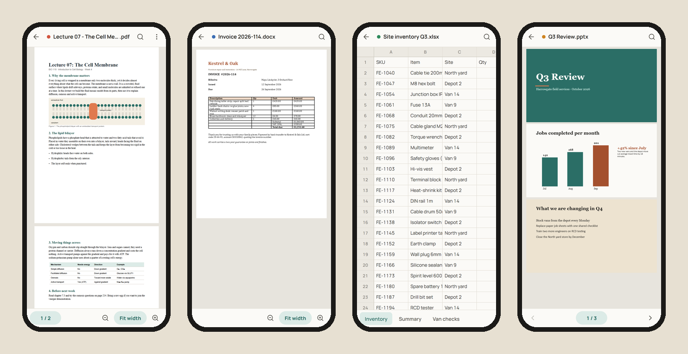
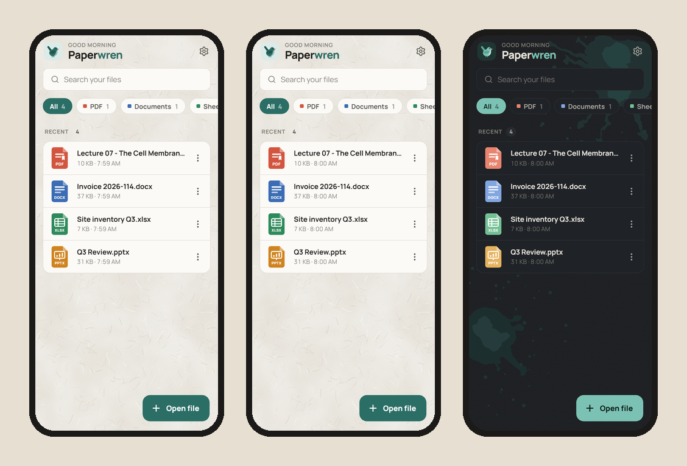
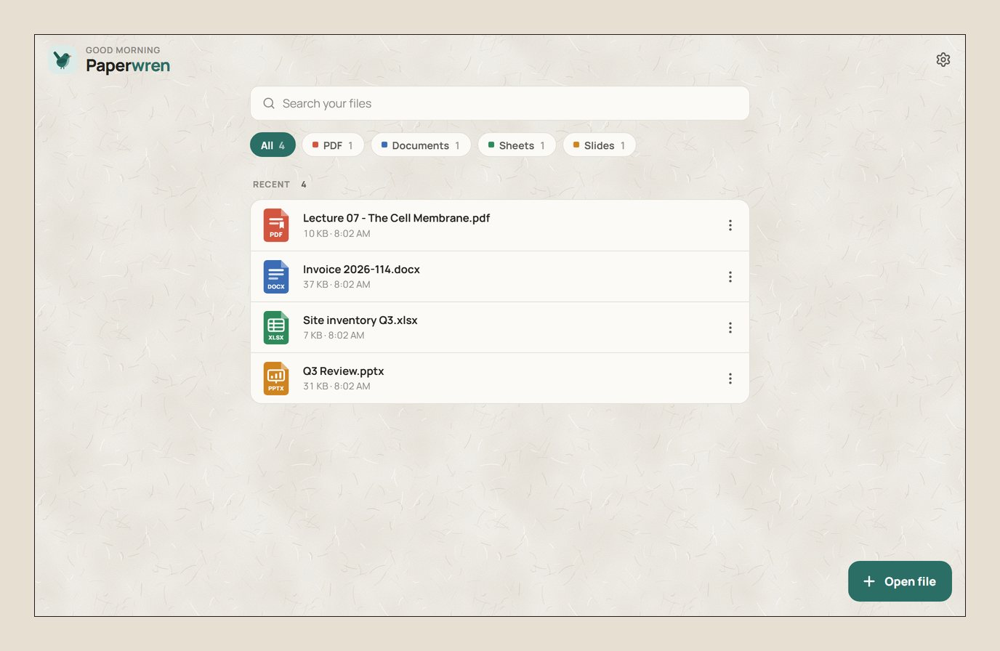

# Paperwren

**Open anything. Instantly.**

Paperwren is a small, fast document viewer. It opens PDF, Word, Excel, PowerPoint, OpenDocument, RTF, CSV, Markdown and plain-text files, and pictures. It has no ads and no accounts, never touches the network, and asks for no permissions.



## What it opens

| Format | How it is shown |
|---|---|
| PDF | pdf.js viewer: fast virtualised pages, text selection, links, find with highlights, contents, rotate, password-protected files. Go to a page by number, pick one from a sheet of page thumbnails, or drag the handle on the right edge |
| Word `.docx` | The document's own page layout (docx-preview), fit to width, find, "3 / 12" page counter and go to page. Long documents only lay out the pages near the screen |
| Excel `.xlsx` `.xlsm` `.xlsb`, `.xls`, `.ods`, `.csv` `.tsv` | Virtualised grid: frozen rows and columns, merged cells, sheet tabs, find across every sheet, zoom that keeps the headers pinned. Select a range (drag, shift-click, or the corner grip on touch) to copy it and see its sum, average and count. Drag a column edge to resize, double-click to fit. `.xlsx` cells keep their bold/italic, text colours, fills, borders and alignment; long text runs over empty neighbours; charts and pictures on a sheet are drawn where the file puts them |
| PowerPoint `.pptx` | Slides drawn from their own shapes, theme colours, layouts, freeform outlines, gradients, shadows, cropped pictures and tables, plus speaker notes. Bar, line, area, pie, doughnut and scatter charts are drawn from the numbers stored in the file; SmartArt is drawn from the shapes the file saved for it. Full screen shows one slide at a time: swipe, tap a side, or use the arrow keys |
| Legacy `.doc`, OpenDocument `.odt` | A flowing document with its formatting, lists, tables and pictures (the page layout is not reproduced, and the viewer says so). Word 6/95 files and `.rtf` show their text |
| Legacy `.ppt`, OpenDocument `.odp` | Drawn as slides, like `.pptx`: shapes, text, pictures, tables and backgrounds |
| Markdown, text, logs, JSON, XML | Rendered Markdown (sanitised) or plain text with encoding detection |
| Pictures `.png` `.jpg` `.gif` `.webp` `.bmp` | Fitted to the screen, zoomable: a scan or a photo of a page is a document too |

Password-protected `.docx`, `.xlsx` and `.pptx` files open with their password (both the Office 2007 and the Office 2010+ encryption). The password is used in memory, once, and never stored. Protected `.doc`/`.xls`/`.ppt` files, and files locked with a certificate or rights management, are not opened; the app says so.

Right-to-left text (Arabic, Urdu, Hebrew) reads from the right in slides, documents, text files and sheet cells, whether or not the file says so.

The bytes decide the format, not the file name: content URIs without extensions and files with the wrong extension still open in the right viewer.

On desktop, drop a file anywhere on the window to open it.

## Around the document

- **The file menu** in every viewer: share (or save a copy), open in another app, show in folder, print, details. What a platform cannot do is left out rather than greyed out.
- **Print** lays the whole document out again for paper, including pages that were never scrolled into view.
- **Folders**: pick a folder on Home to browse the documents inside it, with the same search and type filters as recents.
- **Large files**: a file big enough to be slow, or to be more than a phone can hold, asks before it is read.
- **Keep the screen on** while a document is open (off by default; no permission needed).
- **Languages**: English, 中文, हिन्दी, Español, Français, العربية and اردو, following the phone or chosen in Settings. Arabic and Urdu mirror the app; documents keep their own direction. See "Translations" below.

Every viewer zooms the same way: pinch, double-tap, Ctrl+wheel (or a trackpad pinch), Ctrl `+` `-` `0`, or the control in the bottom bar. The point under your fingers stays put, and the page follows them without re-rendering until you let go. In the text-only viewers the same gestures change the text size.

## Look and feel

- Flat and calm: solid colours, no gradients, blur or drop shadows, and only short one-shot transitions.
- Three themes tuned for long reading, plus Auto (Paper by day, Ink at night):
  - **Paper**: warm off-white with a faint paper-fibre texture and a pine-teal accent.
  - **Sand**: low-blue-light parchment with a fine sand grain and a terracotta accent.
  - **Ink**: soft charcoal (not pure black) with ink splatters in the corners and a mint accent.
  Textures sit on page backgrounds only; cards and documents stay plain.

  
- A flat wren mascot (also the app icon), a four-step welcome with a live theme picker. Files opened from other apps skip it.
- Motion respects the system "reduce motion" setting.
- SVG assets: `assets/icons/*.svg` (one per format), `assets/brand/wren.svg` and the app icons are exported from the same geometry the app renders: `npx vite-node scripts/export-assets.tsx`.

## Privacy

- No network access and no analytics. The release APK requests zero Android permissions.
- Recents and settings live in app-private storage. On Android, files opened from the picker or shared into the app are kept as private copies (deduplicated by content hash, capped at 250 MB) so recents still reopen after the app is closed; they can be deleted in Settings.
- Passwords (PDF and Office) are used once, in memory, and never stored.

## Windows

The same app ships as a small Windows installer.



## Website

The marketing site (home, comparisons, privacy policy, security) lives in
`website/`, built with Astro. See `docs/14-website.md` for the design
direction and where the comparison data comes from.

```bash
cd website
npm install
npm run dev            # http://localhost:4321/Paperwren/
npm run build          # astro check + static build into website/dist
```

## Development

Requirements: Node 20+. Rust is only needed for the desktop shell and `cargo test`.

```bash
npm install
npm run dev            # web preview at http://localhost:1420 (in-memory backend)
npm run lint           # biome
npm run build          # tsc + vite
npm test               # unit tests (vitest)
cargo test --manifest-path src-tauri/Cargo.toml

# Browser tests against the production build
npm i --no-save @playwright/test && npx playwright install chromium
npm run build && npx playwright test
```

Fixtures:

- `python3 scripts/make-office-fixtures.py`: the basic Office/ODF/RTF samples (needs python-pptx, python-docx and LibreOffice).
- `python3 scripts/make-rich-fixtures.py`: styled and frozen workbooks, chart and effect decks, right-to-left text, a picture, and password-protected PDF and Office files (needs openpyxl, Pillow, python-pptx, reportlab, msoffcrypto-tool). The password is `wren`.
- `fixtures/legacy/` and `fixtures/odf/` are real files from the Apache POI and LibreOffice test suites; see the README in each.

### Translations

Interface text is written in English in the code (`t("Open file")`) and looked up by that text. The translations live in one table, `scripts/locales/strings.py`, one row per string with every language side by side; `python3 scripts/make-locales.py` writes `src/lib/locales/*.ts` from it. A unit test fails if a string in the code is missing from any language, or if a table has a string the code no longer uses.

The Urdu, Arabic, Chinese, Hindi, Spanish and French texts were written without a native reviewer. Corrections are welcome: edit the row in `strings.py` and regenerate.

## Architecture

```
src/
  lib/            pure logic, unit-tested
    formats.ts    format registry + magic-byte sniffing
    recents.ts    recents rules (dedupe, pinning, limits, migration)
    settings.ts   settings validation + migration
    backend.ts    the one platform boundary (Tauri or browser)
    i18n.ts       interface languages; locales/ holds the generated tables
    office/       legacy and ODF readers (.doc, .ppt, .odt, .odp, RTF),
                  and decryption of password-protected Office files
    pptx/         PowerPoint parser (theme, layout/master inheritance, charts)
    sheetStyles.ts  cell styles, frozen panes, charts and pictures of a workbook
    print.ts      lays a document out again for paper
    parseWorker.ts  SheetJS, legacy Office parsing and decryption, off the main thread
  state/          React providers: settings, recents, navigation/Back
  ui/             small component kit (CSS Modules)
  screens/        Home, Settings, viewer/ (one lazily loaded chunk per engine)
src-tauri/
  src/            Rust core: store.rs (atomic JSON store), imports.rs (managed copies), error.rs
  android/        MainActivity.kt: Open with / Share ingestion, Back bridge, picker bridge
scripts/          install-android.mjs (applies the activity + manifest), icon/signing helpers, fixtures
```

See `docs/13-redesign.md` for the audit that led to this structure.

## Builds and releases

A push to `main` runs CI (lint, type check, unit tests, Rust tests) and the release pipeline, which bumps the patch version and publishes a Windows installer and an Android APK. The APK is signed with a debug key and is meant for testing.

## License

MIT. Bundled libraries keep their own licenses, listed in the app under Settings, About.
