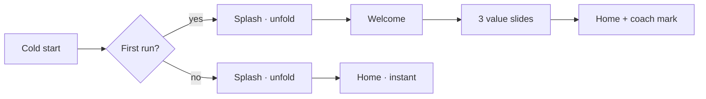

# 06 · Onboarding & Welcome Flow

> The first 20 seconds decide the review. Paperwren's onboarding is skippable in one tap, takes 20 seconds end-to-end, requests nothing, and ends with the user opening a real file.

---

## 1. Flow rules

- **One-tap escape:** "Skip" is always visible on every slide. Skipping is a valid choice, not a failure — nothing is gated behind onboarding.
- **Second launch never sees it.** No "rate us" interstitial, no update screens, no re-onboarding.
- **No permissions screen.** Paperwren requests zero permissions (doc 11) — saying so is a *feature slide*, not a permission flow.
- Runs fully offline; no assets load remotely.

## 2. The Welcome screen (SCR-W)

The brand moment. Everything else in the app is quiet; this one screen is allowed to be beautiful.

**Layout (top → bottom, centered):**
1. Logo animation — "The Fanned Stack" unfolds (doc 04 §3.1), ≤ 480 ms
2. Wordmark **Paperwren** in Fraunces `display`
3. Tagline in `body` `ink-2`

> **COPY**
> **Paperwren**
> *Open anything. Instantly.*

**Actions:**
- **Filled button:** "Open a file" — immediately exits onboarding and opens the system picker. Power users are done in 5 seconds.
- **Ghost button:** "See what Paperwren does" → starts the 3 slides.
- **Text button (top-right):** "Skip"

## 3. Value slides

Design: full-bleed illustration area (top 45%, paper-collage style, doc 03 §4), headline `title-l` in **Fraunces**, body `body` `ink-2`, one slide at a time, swipe or dots. Progress dots: ember active pill (doc 04 §3.5).

### Slide 1 — Formats

> **COPY**
> **Every document, one app**
> PDF, Word, Excel, and PowerPoint — tap a file and it just opens. No accounts, no converters, no waiting.

*Illustration: four fanned format sheets (§2 glyphs) lifting out of a folder.*

### Slide 2 — Privacy

> **COPY**
> **Private by design**
> Paperwren asks for zero permissions and collects zero data. Your files never leave your phone — the app doesn't even have internet access.

*Illustration: a sheet with a shield outline behind it; a small "no-cloud" line through a cloud doodle.*

### Slide 3 — Light

> **COPY**
> **Feather-light**
> Around 15 MB, starts in about a second, and runs fine on modest phones. That's the whole point.

*Illustration: a single sheet with a feather resting on it; size badge "15 MB" as a caption chip.*

**Slide controls:** Back (ghost, appears from slide 2) · Next (tonal) · last slide Next becomes **"Get started"** (filled) → Home.

## 4. Post-onboarding coach marks

One-time, dismiss-on-tap-outside, never repeat (stored flag per mark):

| Mark | Trigger | Copy |
|------|---------|------|
| **CM-1 "First open"** | Home, empty, 1 s after arrival | Bubble from FAB: "Tap to pick your first file — or open any document from your Files app and choose Paperwren." |
| **CM-2 "Hide the controls"** | First viewer open, 1.5 s after render | Center-screen subtle tap ripple: "Tap the middle to hide the buttons while you read." |
| **CM-3 "Remember"** | Second open of the same file, after scroll position restores | Snackbar: "Picked up where you left off — change this in Settings." |

## 5. State & edge cases

| Case | Behavior |
|------|----------|
| User opens a file *from another app* on first run | Onboarding is **bypassed entirely**; viewer opens directly; CM-2 still shows. Reading the file is the onboarding. |
| Process death mid-onboarding | Restart at Welcome (cheap; 20 s flow). |
| "Open a file" then cancel picker | Land on Home (now with empty state), not back into slides. |
| Dark theme first run | Follows system theme from the first frame — no white flash (splash uses theme bg). |

## 6. Accessibility

- All slides fully TalkBack-navigable; illustrations have concise descriptions ("Four colored document sheets fanned out of a folder").
- Auto-advance: **none.** Slides move only on user action.
- Reduced motion: unfold and parallax become 100 ms crossfades (doc 04 §7).
- Text respects system font scale (headline wraps to 2 lines gracefully; layout tested at 200%).

---

*Next: [07 · Viewer Specifications](07-viewers.md) — the heart of the app, format by format.*
