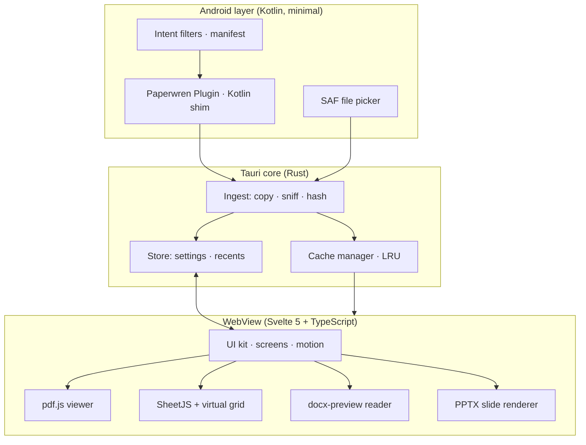
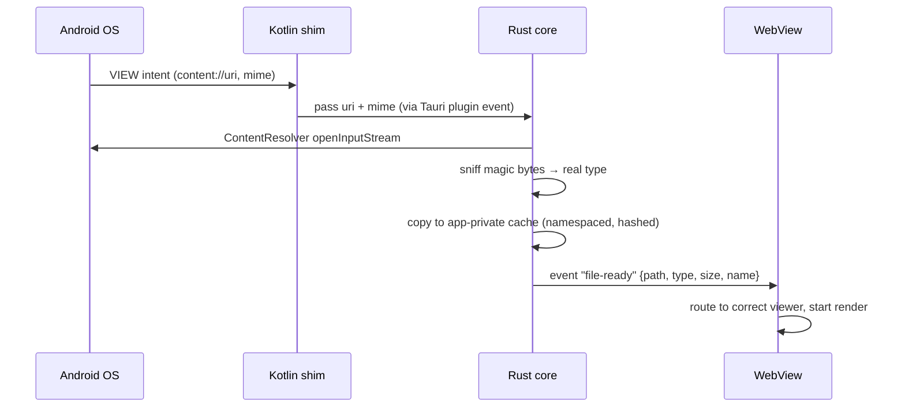

# 10 · Technical Architecture

> Planning-level architecture: what each piece is, why it was chosen, and how the "open with → Always" magic works. No code — decisions and contracts only.

---

## 1. High-level shape



**Layer contract:** Kotlin touches *only* "receive intent / read content URI / hand bytes to Rust." Rust handles files & storage. The WebView handles all rendering and UI. No business logic in Kotlin — keeps the native surface tiny and auditable.

## 2. Stack decisions

| Layer | Choice | Why | Alternatives considered |
|-------|--------|-----|------------------------|
| Shell | **Tauri 2 (Android stable)** | Small APK (~15–25 MB incl. assets), Rust file layer, shared future iOS/desktop code, system WebView = no bundled browser | Flutter (no good Office web renderers story), React Native (heavier), pure Kotlin (Office rendering would still be web-based — same WebView, more glue) |
| UI framework | **React 18 + TypeScript + styled-components** | The project scaffold the team standardized on (Tauri + React boilerplate); predictable state model, CSS-var theming keeps runtime color logic out of components. Svelte 5 remains the recommended smaller-runtime option if the bundle budget ever demands it | Svelte 5 (smallest bundle; deferred for ecosystem familiarity), SolidJS (fine, smaller ecosystem), vanilla (velocity cost) |
| PDF | **pdf.js** (MPL-2.0) | The reference web PDF engine; progressive render, text layer, outline, search — all built in | pdfium native bindings (better perf, loses text search/selection work; revisit if perf gate fails) |
| DOCX | **docx-preview** (Apache-2.0) | Best-in-class HTML fidelity for view-only | mammoth (semantics, loses layout), custom OOXML (v2 if fidelity demands) |
| XLSX | **SheetJS CE** (Apache-2.0) + **custom virtual grid** | Parse is solved; grids with 100k+ rows must be virtualized (no library grid is both light and good) | Handsontable (heavy/commercial), canvas grid lib (licensing risk) |
| PPTX | **Custom renderer, PPTXjs evaluated as base** | Existing libs are janky; scope is bounded (text/images/tables/shapes) | LibreOfficeKit (100 MB+ — kills the brand promise) |
| Misc JS | **fflate** (MIT) unzip, **file-type** sniffing | OOXML = zips; tiny deps only | — |
| Fonts/icons | Manrope, Fraunces, Lucide | OFL/ISC, subset locally | — |

> License rule: every dependency is recorded with license + version in the licenses screen generator (doc 12). Verify at integration time; nothing copyleft-AGPL enters the app.

## 3. The "open with" pipeline ★ (the make-or-break feature)



Design decisions:

1. **Manifest intent filters** declare `ACTION_VIEW` + `ACTION_SEND` for: `application/pdf`, `application/vnd.openxmlformats-officedocument.{wordprocessingml.document, spreadsheetml.sheet, presentationml.presentation}`, plus text/csv and ODF mime set (v1.3), with mime-type **and** file-extension patterns (many file managers only send extensions).
2. **`launchMode="singleTask"`**: second "open with" while running → `onNewIntent`, not a second app instance. Back stack stays sane.
3. **Content URIs, never paths:** all access via ContentResolver/SAF. The cache copy gives parsers a seekable local file. Cache lives in app-private storage (`cacheDir`) — readable by nothing else, no permission needed.
4. **Type sniffing is magic-byte-first** — file managers lie about extensions constantly; wrong viewer = 1-star review.
5. **"Always":** set by the OS after user picks Paperwren + Always; nothing to build — but reliability here (correct mime declarations, stable activity, fast cold start) is what earns the tap.

## 4. In-app open (SAF)

FAB → system document picker (`OpenDocument`, multiple mime filter). The returned URI is persisted as a **persistable permission** so recents can re-open the same file later without re-picking. Revoked access → E-06 flow (doc 09).

## 5. Data & storage map

| Data | Where | Format | Lifetime |
|------|-------|--------|----------|
| Settings | app-private files dir | JSON key-value (doc 08 keys) | until cleared |
| Recents | app-private files dir | JSON list (path-uri, name, format, position, size, timestamps, pinned) | per `files.recents_limit` |
| File cache | app-private cache dir | content-copied originals, hashed names | LRU purge at 250 MB or 30 days; user-clearable |
| Position memory | inside recents entries | page + scroll + zoom | with the recents entry |

**Nothing leaves the device. No network permission is requested.** (Tauri's WebView has no special network grant by itself; we simply never fetch.)

## 6. WebView configuration & security

- **CSP:** local-only (`default-src 'self'`); wasm/pdf.js worker allowances scoped; **no remote origins anywhere.**
- `minSdk 26` (Android 8.0), `targetSdk` = current Play requirement (35+ at time of build).
- Devtools disabled in release builds; debug builds only in debug flavor.
- No `eval`, no remote JS, no third-party runtime code loading.
- File cache paths are internal-only; WebView loads via Tauri asset protocol scoped to the cache dir (path-traversal tested).
- Password dialog inputs: `type=password`, never logged, never persisted (doc 07 §2).

## 7. Performance budgets (gates, not hopes)

| Metric | Budget | Measured on |
|--------|--------|-------------|
| APK download size | ≤ 25 MB | release bundle, per-ABI split |
| Cold start → interactive (Home) | p50 ≤ 1.2 s · p90 ≤ 2.0 s | reference low-end device (see doc 12) |
| PDF first paint (10 MB file) | ≤ 800 ms | same |
| PDF scroll (200-page doc) | 60 fps, no blank-page flashes > 100 ms | same |
| XLSX parse (10 MB / 100k rows) | ≤ 2.5 s with progress bar | same |
| Viewer RAM ceiling | ≤ 350 MB steady-state (typical files) | Android profiler |
| Cache LRU purge | at 250 MB or 30 days | automated test |

Approach: budgets are CI-visible (build-size check automated; perf runbook manual per release, doc 12).

## 8. Risks & mitigations

| Risk | Impact | Mitigation |
|------|--------|------------|
| WebView fragmentation (old Chromium) | Rendering bugs on old devices | minSdk 26 + feature-detect CSS/JS; smoke-test on oldest supported WebView in matrix |
| PPTX fidelity rabbit hole | Schedule slip | v1.2 scope frozen (doc 07 §5); placeholder chips instead of half-rendered chaos |
| Huge-file OOM on 2 GB devices | 1-star reviews | E-04 pre-warn + virtualization + E-05 graceful page; never crash |
| Content-URI quirks across OEM file managers | Open fails oddly | Magic-byte sniffing + test corpus via WhatsApp/Gmail/Drive/Files paths (doc 12) |
| Tauri Android toolchain churn | Build breakage | Pin toolchain versions; CI builds on every commit to main |

## 9. Repository layout (planned)

```
paperwren/
├── docs/               ← this documentation set
├── src/                ← React UI (screens, ui-kit, viewers, state)
├── src-tauri/          ← Rust core (storage, cache, commands)
├── assets/brand/       ← icons, glyphs, fonts, illustrations (SVG sources)
├── fixtures/           ← the test corpus (doc 12 §3); regenerate with scripts/make-fixtures.mjs
├── scripts/            ← fixture generator + Android CI patch scripts
└── .github/workflows/  ← CI: check, size budget, release builds
```

> Platform note: the frontend talks to exactly one backend interface
> (`src/lib/backend.ts`). In Tauri it routes to the dialog/fs plugins
> and Rust commands; in a plain browser it routes to in-memory and
> localStorage implementations so the whole UI is testable without a
> native shell.

---

*Next: [11 · Privacy & Compliance](11-privacy.md) — the "zero" promise, in writing.*
